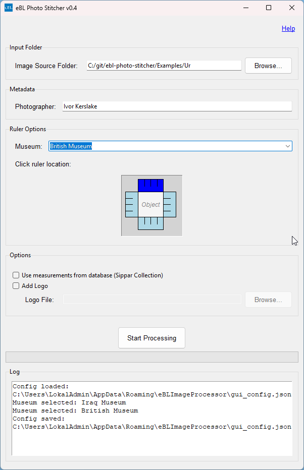

# eBL Photo Stitcher

## Table of Contents

- [Overview](#overview)
- [Features](#features)
- [File Structure Overview](#file-structure-overview)
- [Prerequisites](#prerequisites)
- [Setup](#setup)
- [Usage (Python)](#usage-python)
- [Usage (GUI)](#usage-gui)
- [Configuration](#configuration)
- [Packaging (Optional)](#packaging-optional)
- [U2NET Model Setup](#u2net-model-setup)

## Overview

The eBL Image Processor is a Python-based application designed to automate a multi-step workflow for processing sets of archaeological or cuneiform tablet images. It includes features for RAW image conversion, object extraction, ruler scale detection, digital ruler generation, image stitching, metadata embedding, and logo addition, all managed through a user-friendly GUI.

This project has been developed to streamline the image processing pipeline, inspired by and translating functionalities from existing Photoshop scripts into an open-source Python environment.



## Features

* **Graphical User Interface (GUI):** Easy-to-use interface for selecting input folders, specifying ruler position, and managing options.
* **File Organization:** Automatically groups images by base name into subfolders (e.g., all images for "BM.58103" go into a "BM.58103" subfolder).
* **RAW Image Processing (.CR2):**
    * Converts CR2 RAW files to 16-bit TIFFs.
    * Attempts to minimize sharpening during RAW development using `rawpy`.
    * Includes experimental support for lens correction via `lensfunpy` (requires Lensfun database).
* **Ruler Scale Detection:** 
    * Detects a physical ruler in a designated image (e.g., `_02.tif` or `_03.tif`) to determine `pixels_per_centimeter`. 
    * Supports ruler placement at top, bottom, left, or right of the image.
    * Special Iraq Museum ruler detection with dedicated algorithm.
    * Fallback to database measurements for British Museum Sippar Collection.
* **Object Extraction:**
    * Uses state-of-the-art `rembg` library with U2NET model for precise object extraction.
    * Automatically selects the object closest to the image center among the largest detected objects.
    * Extracts the main artifact from each view image (e.g., `_01.tif`, `_04.tif`, etc.) and saves it as `NAME_VIEWNUM_object.tif`.
    * For the image used for scale detection, it extracts both the artifact and the physical ruler into separate files if needed (though the final stitched ruler is digital).
* **Digital Ruler Replacement:**
    * Based on the detected scale and object size, selects an appropriate digital ruler template (1cm, 2cm, or 5cm).
    * Museum-specific rulers for British Museum, Iraq Museum, eBL Ruler (CBS), and Non-eBL Ruler (VAM).
    * Scales this digital ruler and saves it as `NAME_ruler.tif`.
* **Image Stitching/Compositing:**
    * Arranges multiple extracted object views (obverse, reverse, top, bottom, left, right, and rotated sides) and the scaled digital ruler into a final composite image layout.
    * Supports padding between stitched views.
* **Logo Addition:** Optionally adds a user-specified logo to the bottom of the final stitched image.
* **Metadata Embedding:**
    * Sets basic EXIF metadata (photographer, copyright, title, DPI) using `piexif`.
    * Applies detailed XMP metadata (DC, Photoshop, XMPRights namespaces) using `pyexiv2`.
    * Museum-specific metadata templates.
* **Output:** Saves the final composite image as a high-quality TIFF (`_stitched.tif`) and a JPEG (`_stitched.jpg`).
* **Configuration Persistence:** Remembers the last used input folder, ruler position, photographer name, and logo settings via a `gui_config.json` file.

## File Structure Overview

The project is modular, with specific tasks handled by different Python scripts:

* `gui_app.py`: The main application file that launches the Tkinter GUI.
* `lib/gui_workflow_runner.py`: Orchestrates the image processing steps initiated by the GUI.
* `lib/gui_utils.py`: Utility functions for the GUI (e.g., resource path handling, config directory).
* `lib/put_images_in_subfolders.py`: Organizes input images into subfolders.
* `lib/raw_processor.py`: Handles RAW (e.g., CR2) image conversion and initial processing, including Lensfunpy integration.
* `lib/ruler_detector.py`: Detects the scale (pixels/cm) from an image containing a physical ruler.
* `lib/ruler_detector_iraq_museum.py`: Special detector for Iraq Museum ruler format.
* `lib/object_extractor_rembg.py`: AI-powered object extraction using rembg and U2NET model.
* `lib/object_extractor.py`: Legacy object extraction module (still used for ruler extraction).
* `lib/remove_background.py`: Core logic for creating masks and selecting contours (artifact, ruler).
* `lib/resize_ruler.py`: Scales the chosen digital ruler template to the correct dimensions.
* `lib/stitch_images.py`: Main orchestrator for the image stitching/compositing process.
* `lib/stitch_file_utils.py`: Utilities for finding and loading files for stitching.
* `lib/stitch_layout_utils.py`: Logic for calculating canvas size and view positions for stitching.
* `lib/stitch_enhancement_utils.py`: Handles logo addition and final cropping/margin for stitched images.
* `lib/metadata_utils.py`: Functions for writing EXIF and XMP metadata.
* `lib/image_utils.py`: Generic image processing helper functions.
* `lib/measurements_utils.py`: Functions for working with tablet measurements database.

## Prerequisites

* Python 3.8+
* The following Python libraries (install via `pip install -r requirements.txt` or individually):
    * `opencv-python` (for image processing)
    * `numpy` (for numerical operations, used by OpenCV)
    * `pillow` (for image processing with PIL)
    * `rembg` (for AI-powered object extraction)
    * `imageio` (for robust TIFF saving with DPI)
    * `rawpy` (for reading RAW image files)
    * `piexif` (for basic EXIF metadata handling)
    * `pyexiv2` (recommended, for comprehensive metadata handling including XMP)
    * `lensfunpy` (optional, for lens corrections in RAW processing - requires Lensfun database installed system-wide)

## Setup

1.  Clone the repository:
    ```bash
    git clone [https://github.com/your_username/your_repository_name.git](https://github.com/your_username/your_repository_name.git)
    cd your_repository_name
    ```
2.  Install required Python libraries:
    ```bash
    pip install opencv-python numpy pillow rembg imageio rawpy piexif lensfunpy pyexiv2
    ```
3.  (Optional) Install the Lensfun database for `lensfunpy` to work. The method varies by OS.
4.  **Asset Files:**
    * Create an `assets` folder in the root of the project directory (same level as `gui_app.py`).
    * Place the following files inside the `assets` folder:
        * `eBL_logo.png` (or your desired logo for the Tkinter window icon)
        * `BM_1cm_scale.tif` (digital ruler template for British Museum)
        * `BM_2cm_scale.tif` (digital ruler template for British Museum)
        * `BM_5cm_scale.tif` (digital ruler template for British Museum)
        * `IM_photo_ruler.svg` (digital ruler template for Iraq Museum)
        * `General_eBL_photo_ruler.svg` (digital ruler template for eBL/CBS)
        * `General_External_photo_ruler.svg` (digital ruler template for non-eBL/VAM)
        * `u2net.onnx` (U2NET model for object extraction - see U2NET Model Setup section)
        * `sippar.json` (optional - tablet measurements database for British Museum Sippar Collection)

## Ruler Detection Details

The eBL Photo Stitcher uses several methods to determine the correct scale (pixels per centimeter) for proper image processing. This scale detection is crucial for accurate digital ruler placement and maintaining proper proportions in the final stitched image.

### How Ruler Detection Works

The application supports several methods of determining the scale, which vary by museum:

#### British Museum Style

For British Museum tablets, the application expects:

1. **Ruler Placement**: A physical ruler should be placed along one edge of the image.
2. **Ruler Image**: Scale detection is performed on the image with suffix `_02.tif` (reverse view) or `_03.tif` (top view) by default.
3. **Detection Method**: The algorithm looks for evenly spaced ruler markings along the edge where you indicated the ruler is positioned.
   - The ruler should have clear black/dark markings on a white/light background
   - The markings should be evenly spaced (e.g., 1cm or 5mm apart)
   - The ruler should be aligned as straight as possible along the edge
   - At least 5-7cm of ruler markings should be visible for optimal detection

**Example British Museum ruler placement:**
- Place a standard archaeological scale ruler along the bottom edge of the image
- Ensure the ruler is parallel to the image edge
- Make sure the ruler markings are clearly visible and not obscured

#### Iraq Museum Style

For Iraq Museum tablets:

1. **Ruler Placement**: The ruler is expected to be in the bottom-left corner.
2. **Ruler Image**: Detection is performed on the image with suffix `_03.tif` (top view).
3. **Detection Method**: A specialized algorithm detects the Iraq Museum's particular ruler format:
   - The ruler appears as a white L-shaped corner ruler with black markings
   - Each mark represents 1cm
   - The ruler should be clearly visible and well-lit
   - The ruler corner should be positioned at the bottom-left of the image

**Example Iraq Museum ruler placement:**
- The L-shaped corner ruler should be positioned in the bottom-left corner
- Both horizontal and vertical arms of the ruler should be visible
- The ruler should be correctly oriented with numbers readable

#### eBL Ruler (CBS) and Non-eBL Ruler (VAM) 

These options use similar detection methods to the British Museum style but apply different digital ruler templates to the final output.

### Database Measurements Option

For the British Museum's Sippar Collection, you can optionally use pre-recorded measurements:

1. **Enable the Option**: Check "Use measurements from database" in the GUI.
2. **How it Works**: 
   - The program will look up the tablet's dimensions in the included database
   - Physical dimensions are used to calculate the scale without ruler detection
   - This can be useful when ruler detection is challenging or the ruler isn't clearly visible

### Best Practices for Optimal Ruler Detection

For reliable scale detection:

1. **Lighting**: Ensure even lighting on the ruler to make markings clearly visible.
2. **Positioning**: Place the ruler flat and straight along the edge you specify in the GUI.
3. **Ruler Quality**: Use a clean, high-contrast ruler with clear markings.
4. **Image Quality**: Ensure the ruler is in focus and takes up a reasonable portion of the image edge.
5. **Ruler View Image**: For best results, make sure the ruler is clearly visible in the designated image (typically `_02.tif` or `_03.tif`).

If ruler detection fails, the application will report an error. You can:
- Try a different ruler position
- Improve the lighting or clarity of the ruler in your images
- For British Museum Sippar Collection tablets, try using the database measurements option

## Usage (Python)

1.  Navigate to the project directory in your terminal.
2.  Run the GUI application:
    ```bash
    python gui_app.py
    ```
    
## Usage (GUI)

1. **Classify and rename images**: First, rename all the files in your folder according to the pattern: `TABLET_NUMBER` + `_`+ `SIDE_CODE`. You should follow these naming patterns for your `SIDE_CODE`:
- `_01` = obverse
- `_02` = reverse
- `_03` = top
- `_04` = bottom
- `_05` = left
- `_06` = right

For intermediate views (between the obverse or the reverse and one of the side views), use:
- `_07` or `_ol` = intermediate between obverse and left
- `_08` or `_or` = intermediate between obverse and right
- `_ot` = intermediate between obverse and top
- `_ob` = intermediate between obverse and bottom
- `_rl` = intermediate between reverse and left
- `_rr` = intermediate between reverse and right
- `_rt` = intermediate between reverse and top
- `_rb` = intermediate between reverse and bottom

For example, if your tablet has ID "IM.136546", the obverse image would be named "IM.136546_01.JPG" and an intermediate image between obverse and left would be "IM.136546_ol.JPG".

2. **Select Image Source Folder:** Browse to the folder containing your sets of images (e.g., `BM.58103_01.cr2`, `BM.58103_02.cr2`, etc.).
 


3. **Photographer:** Enter the photographer's name. This will be saved for future sessions.
4. **Museum:** Select the appropriate museum for your tablet images (affects ruler style and metadata):
   - British Museum: Uses traditional scale rulers and standard metadata
   - Iraq Museum: Uses specific ruler detection algorithm and custom metadata
   - eBL Ruler (CBS): For tablets with eBL/CBS rulers
   - Non-eBL Ruler (VAM): For tablets with external/VAM rulers
5. **Ruler Position:** Click on the abstract image representation to indicate where the physical ruler is located in your source images (used for scale detection). For Iraq Museum, the position is fixed at bottom-left.
6. **Use measurements from database (Sippar Collection)**: When this option is checked and available, the application will use the known physical dimensions of a tablet from the program's database instead of relying on ruler detection. Only available for British Museum's Sippar Collection.
7. **Logo Options (Optional):** Check "Add Logo" and browse to your logo file if you want a logo on the final stitched image.
8. Click **"Start Processing"**.

The application will:
1.  Organize images from the source folder into subfolders based on their base name.
2.  For each subfolder:
    * Convert CR2 files to TIFFs, applying RAW processing (minimal sharpening, lens correction if possible).
    * Identify the designated ruler image and detect the `pixels/cm` scale using the appropriate method for the selected museum.
    * Extract the main artifact from all images using the AI-powered rembg object extraction.
    * Choose an appropriate digital ruler template based on the museum selection and object size.
    * Scale this digital ruler template and save it as `NAME_ruler.tif`.
    * Stitch all `*_object.tif` views and the scaled digital `_ruler.tif` ruler into a composite image.
    * Add padding between views, and optionally add a logo.
    * Apply a final margin and save as `NAME_stitched.tif` and `NAME_stitched.jpg` with embedded metadata.

Logs and progress will be displayed in the GUI.

## Configuration

* **GUI Settings:** The GUI remembers the last used input folder, ruler position, photographer name, museum selection, and logo settings in a `gui_config.json` file. This file is typically stored in your user-specific application data directory.
* **Script Constants:** Paths to digital ruler template assets and other default processing parameters are defined as constants at the top of `gui_app.py` and the respective utility modules (e.g., `stitch_images.py`). For a packaged application, these asset paths are resolved relative to the executable.

## Packaging (Optional)

You can package this application into a standalone executable using PyInstaller:

```bash
pyinstaller eBLImageProcessor.spec

## U2NET Model Setup
The application uses the U2NET model for AI-powered object extraction via the rembg library. To avoid downloading the model during runtime:

1. Download the U2NET model (`u2net.onnx`) from the [rembg repository](https://github.com/danielgatis/rembg/releases/download/v0.0.0/u2net.onnx)
2. Place it in the assets folder of your project
3. When the application runs, it will automatically copy this model to the expected location in your user directory (`~/.u2net/u2net.onnx`)
4. This prevents the application from attempting to download the model during processing, which can be slow or fail if internet connectivity is limited.